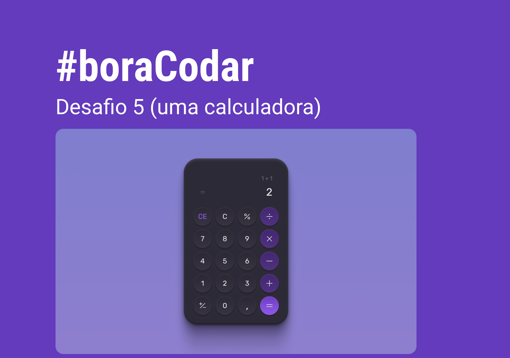

<h1 align="center"> Calculadora </h1>

Programa exclusivo e gratuito, promovido pela Rocketseat para ensino de tecnologias WEB.  
<a > fiz o projeto ficar funcional por conta propria, Aonde o Designer foi feito pela empressa Rocktseat</a>

 <a href="#-tecnologias">Tecnologias</a>&nbsp;&nbsp;&nbsp;| &nbsp;&nbsp;&nbsp;
 <a href="#-projeto">Projeto</a>&nbsp;&nbsp;&nbsp;| &nbsp;&nbsp;&nbsp;
 <a href="#-layout">Visualização</a>&nbsp;&nbsp;&nbsp;| &nbsp;&nbsp;&nbsp;
  <a href="#memo-licença">Licença</a>

 

 

  

## 🚀 Tecnologias

Esse projeto foi desenvolvido com as seguintes tecnologias:

- HTML e CSS
- JavaScript (em inglês)
- Git e Github
- Figma

## 💻 Projeto

A Calculadora um projeto que seu Layout foi feito pelo Rockseat, e a fiz ser funcional, com o Basico de javascript!

## 🔖 Visualização

Você pode visualizar o projeto atraves [DESSE LINK](https://vinivy.github.io/Calculadora/).

## :memo: Licença

Esse projeto está sob a licença MIT.

🚀

